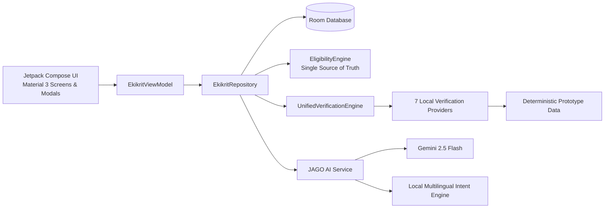

# Ekikrit

**One app for every scholarship a Scheduled Tribe student is entitled to.**

Ekikrit is a native Android prototype built for **Smart India Hackathon 2026, Problem Statement SIH26238**. It provides a unified scholarship experience for Scheduled Tribe (ST) students, including PVTG communities, by bringing scholarship discovery, eligibility evaluation, reusable digital documents, multi-source verification, application tracking, reviewer exception handling, DBT visibility and multilingual assistance into one mobile application.

> **Prototype status:** Government registry integrations are simulated for this prototype. UIDAI, DigiLocker, APAAR, AISHE, UDISE+, UGC/NTA and e-District responses are implemented as deterministic local verification providers so the complete workflow can be demonstrated without depending on live government systems.

---

## Why Ekikrit?

A student may be eligible for multiple scholarship pathways but still face fragmented portals, repeated document uploads, unclear application status and delays when information from different records does not match.

Ekikrit is designed around one beneficiary journey:

* **Discover once:** evaluate the student's profile against five scholarship pathways.
* **Upload once:** keep reusable digital credentials in one wallet.
* **Verify together:** run seven verification checks through one unified workflow.
* **Handle exceptions intelligently:** route reviewable discrepancies to an officer instead of automatically rejecting the student.
* **Track everything:** follow application stages, review status and payment information in one place.
* **Make it accessible:** provide English, Hindi, Odia and Gondi interfaces with voice assistance.

---

## Core Features

| Area                            | What it does                                                                                                                |
| ------------------------------- | --------------------------------------------------------------------------------------------------------------------------- |
| **Unified dashboard**           | Shows active applications, pending actions, notifications and current scholarship opportunities.                            |
| **Five scholarship pathways**   | Pre-Matric, Post-Matric, Top Class Education, National Fellowship for ST students, and National Overseas Scholarship.       |
| **Eligibility engine**          | Evaluates category, education level, institution, income and application state and produces eligibility results.            |
| **One-active-scholarship rule** | Prevents conflicting active scholarship applications where the prototype's rules require mutual exclusion.                  |
| **DigiLocker wallet**           | Provides a reusable digital document wallet for caste, income, academic and identity-related credentials.                   |
| **Seven-source verification**   | Demonstrates checks through UIDAI, DigiLocker, APAAR, AISHE, UDISE+, UGC/NTA and e-District.                                |
| **Exception routing**           | A reviewable income variance becomes a non-blocking Reviewer Desk item rather than an automatic rejection.                  |
| **Reviewer Desk**               | Provides an officer-facing queue for resolving verification exceptions.                                                     |
| **Application tracking**        | Shows progress from application submission through institute, state and ministry verification to sanction and disbursement. |
| **DBT payments**                | Consolidates scholarship disbursement information for the beneficiary.                                                      |
| **Unclaimed-beneficiary nudge** | Identifies scholarship pathways for which a student may be eligible but has not yet applied.                                |
| **Audit trail**                 | Records application and reviewer actions with actor and timestamp information.                                              |
| **DPDP consent**                | Provides an explicit consent flow and consent revocation control for AI-related processing.                                 |
| **Offline-first workflow**      | Stores applications locally as drafts and synchronizes when connectivity returns.                                           |
| **Multilingual UI**             | English, Hindi, Odia and Gondi.                                                                                             |
| **JAGO assistant**              | Context-aware assistant for eligibility, status, documents, discrepancies and payment questions.                            |

---

## JAGO: Unified Tribal Scholarship Assistant

**JAGO** is the in-app assistant designed to make scholarship information easier to understand.

It can answer questions about:

* scholarship eligibility
* application status
* pending actions
* DigiLocker documents
* income discrepancies
* DBT payments
* how to apply

### Gemini mode

When a valid Gemini API key is configured and the device has network connectivity, JAGO sends a compact application-state snapshot to **Gemini 2.5 Flash** through Google's Generative Language REST API.

The request is made off the UI thread and uses a short timeout. When Gemini is unavailable, JAGO automatically falls back to its local intent engine.

### Built-in fallback mode

JAGO contains a local multilingual intent engine that can continue answering supported scholarship queries without relying on the Gemini service.

The fallback covers English, Hindi, Odia and Gondi responses for the supported intents.

### AI context and data handling

The current prototype sends a limited state snapshot rather than the complete Room database.

The Gemini context may include application-relevant information such as:

* student name
* category
* institution
* course
* annual income
* DigiLocker-link status
* scholarship names and stages
* application discrepancy state
* disbursement context

The following sensitive identifiers are not included in the Gemini snapshot:

* Aadhaar numbers
* full bank account numbers
* IFSC codes
* mobile numbers
* date of birth
* APAAR identifiers
* institution identifiers
* raw verification-mismatch values

Free-text input is additionally sanitized before being included in the AI request.

JAGO is instructed to use the supplied application state as its source of truth, avoid requesting sensitive identity credentials and ignore instructions embedded in user messages.

> **Production hardening:** Before deployment with live beneficiary data, the AI context should be further minimized and reviewed against final privacy, consent, retention and security requirements.

> **Gondi note:** Gondi support is best-effort and should be reviewed with native speakers before production deployment.

---

## Architecture



### Application layers

**`ui/`**

Jetpack Compose screens, reusable components, localization and `EkikritViewModel`.

**`data/repository/`**

Central repository for students, applications, documents, payments, notifications, reviewer queue data and JAGO context.

**`data/local/`**

Room database, DAOs and deterministic seed data used to provide a reproducible demonstration state.

**`data/remote/`**

Supporting gateway/model structures for verification-related data. The current demo verification flow is implemented through deterministic local providers rather than live government APIs.

**`data/ai/`**

JAGO AI service, Gemini REST integration, language detection, intent classification, sanitization and multilingual fallback responses.

**`domain/`**

Pure Kotlin business logic including:

* `EligibilityEngine`
* `UnifiedVerificationEngine`

---

## What is real and what is simulated?

| Component                                           | Status                                                   |
| --------------------------------------------------- | -------------------------------------------------------- |
| Room database and DAO layer                         | **Real**                                                 |
| Student, scholarship and application business logic | **Real**                                                 |
| Eligibility engine                                  | **Real application logic**                               |
| Unified verification engine                         | **Real application logic**                               |
| Seven verification providers                        | **Real prototype logic with simulated source responses** |
| Government registry records                         | **Simulated**                                            |
| DigiLocker document retrieval                       | **Simulated**                                            |
| Government OTP / identity authentication            | **Local prototype only**                                 |
| Demo student identities                             | **Fictional seed data**                                  |
| Reviewer workflow                                   | **Real application logic using demo records**            |
| JAGO local fallback                                 | **Real application logic**                               |
| Gemini 2.5 Flash integration                        | **Real when a valid API key is configured**              |
| Government production APIs                          | **Not connected in the prototype**                       |

### Prototype verification scenario

For the demonstration workflow:

* UIDAI returns a simulated verified response
* DigiLocker returns a simulated verified response
* APAAR returns a simulated verified response
* AISHE returns a simulated verified response
* UDISE+ returns a simulated verified response
* UGC/NTA returns a simulated verified response
* e-District produces a deterministic income variance
* the variance is treated as a non-blocking exception
* the exception is routed to Reviewer Desk
* the officer can resolve the exception
* the application progresses to the next verification stage

This deterministic setup lets the complete student-to-officer journey be demonstrated consistently without depending on external systems.

---

## Security and Privacy

Ekikrit is designed with privacy, data minimisation and least-privilege principles in mind.

### Data minimisation

The verification workflow operates on the fields required for the relevant prototype checks rather than exposing the complete student profile to every provider.

JAGO receives a compact application-state snapshot instead of the complete local database.

### Sensitive identifier protection

Sensitive identity and financial identifiers are masked in the application UI and are not included in the Gemini request context.

### AI consent

AI processing is subject to the application's consent flow. When consent is revoked, third-party AI processing is skipped.

### Backup configuration

Android application backup is disabled in the application manifest, with explicit backup configuration files included.

### Permission footprint

The application requests:

* `INTERNET`
* `ACCESS_NETWORK_STATE`

No storage, camera, microphone or location permission is required by the core application workflow.

### Reviewer access

The reviewer workflow is controlled through the prototype's officer mode, and the Reviewer Desk is designed around resolving the disputed field rather than requiring access to the student's entire profile.

> The current authentication and authorization model is a demonstration implementation. Production deployment would require government-approved identity, role and access-control mechanisms.

---

## Getting Started

### Requirements

* Android Studio, recent stable release
* JDK 21
* Android SDK 36
* Minimum Android API: 24

### Clone the repository

```bash
git clone https://github.com/theanshdhyani/Ekikrit.git
cd Ekikrit
```

### Build the debug APK

```bash
./gradlew assembleDebug
```

### Install on a connected device

```bash
./gradlew installDebug
```

The application can run without cloud configuration. When Gemini is not configured, JAGO uses its built-in local fallback.

---

## Gemini Configuration

The current JAGO implementation uses **Gemini 2.5 Flash** through Google's Generative Language REST API.

To enable Gemini mode:

1. Configure a valid `GEMINI_API_KEY` through the project's supported secrets configuration.
2. Rebuild the application.
3. Ensure the device has network connectivity.
4. Ensure the student has granted the required AI-processing consent.

Without a valid key, JAGO automatically uses the local multilingual fallback.

> Never commit a real API key to the repository.

---

## Demo Personas

The repository contains fictional seed data for deterministic demonstrations.

### Birsa Munda Tirkey

`STU_2026_01`

* PVTG: Birhor
* Institution: NIT Rourkela
* Course: B.Tech CSE
* Annual income: ₹2,10,000
* Active Post-Matric application
* Demonstration income variance routed to Reviewer Desk
* Historical Pre-Matric award
* Top Class evaluation

### Sunita Soren

`STU_2026_02`

* ST: Santhal
* Institution: IIT Kharagpur
* Course: B.Tech Metallurgical Engineering
* Annual income: ₹3,20,000
* Top Class application shown as sanctioned and disbursed

### Jaipal Singh Munda

`STU_2026_03`

* ST: Ho
* Institution: Utkal University
* Programme: M.Phil/Ph.D Tribal Studies
* Annual income: ₹1,80,000
* High-eligibility candidate for NFST and NOS

### Reviewing Officer

`REV_OFFICER_01`

* District Tribal Welfare Officer
* Demo Reviewer Desk identity
* Used to review and resolve verification exceptions

The application contains a single role-switch control for the student and officer demonstration workflow.

---

## Recommended Demo Flow

```text
Dashboard
   ↓
5 Scholarship Pathways
   ↓
Eligibility Result
   ↓
DigiLocker Wallet
   ↓
Application
   ↓
Seven-Source Verification
   ↓
Income Variance
   ↓
Reviewer Desk
   ↓
Officer Resolution
   ↓
Application Progress
   ↓
DBT Payments
   ↓
JAGO Assistant
   ↓
Language / Voice Assistance
   ↓
Security & Privacy
```

The complete concept can be summarized as:

> **Discover → Verify → Apply → Review → Track → Receive**

---

## Testing

### Run the JVM test suite

```bash
./gradlew testDebugUnitTest
```

The current repository contains **39 test methods** covering eligibility, verification, database integrity, identity isolation, reviewer workflows, JAGO behaviour and multilingual intent handling.

### Build the APK

```bash
./gradlew assembleDebug
```

### Continuous Integration

GitHub Actions currently performs:

1. unit and architecture tests
2. debug APK assembly
3. release APK assembly
4. test-report artifact upload
5. debug APK artifact upload
6. release APK artifact upload

Workflow:

```text
.github/workflows/android.yml
```

---

## Test Coverage

| Test Suite                           | Coverage                                                                                                |
| ------------------------------------ | ------------------------------------------------------------------------------------------------------- |
| `EkikritFinalValidationTest`         | Database seeding, unique constraints, identity isolation, reviewer resolution and end-to-end validation |
| `EkikritVerificationAndReviewerTest` | Repository workflow, seven-source verification, exception creation and reviewer resolution              |
| `EkikritEligibilityAndOwnershipTest` | Eligibility rules, income limits, PVTG entitlement and student isolation                                |
| `EligibilityEngineTest`              | Eligibility scoring, missing-document handling and scholarship conflicts                                |
| `JagoAiServiceTest`                  | JAGO response generation and fallback behaviour                                                         |
| `JagoMultilingualIntentTest`         | Multilingual intent detection                                                                           |
| `UnifiedVerificationTest`            | Seven-source verification execution and exception handling                                              |
| `ExampleRobolectricTest`             | Android/Robolectric environment validation                                                              |
| `ExampleUnitTest`                    | Basic JVM unit-test environment                                                                         |

---

## Known Limitations

This project is a working prototype, not a production deployment.

### Government integrations

Government registries and DigiLocker are simulated.

Production deployment would require:

* approved government APIs or gateways
* official integration agreements
* production authentication and authorization
* monitoring and operational controls

### Authentication

The current login flow is local and does not implement production OTP-based government identity verification.

### Release signing

CI release builds use a generated debug keystore unless a production signing key is supplied.

Therefore, CI release APKs are **not Play Store production artifacts**.

### Database migrations

The current prototype permits destructive migration fallback. Production deployment should introduce complete versioned Room migrations.

### Eligibility hardening

Some prototype eligibility checks use string-based matching and should be replaced with authoritative master-data identifiers before production deployment.

### AI behaviour

Gemini responses are probabilistic. Business-critical eligibility and application state remain governed by the application's domain logic rather than by the model.

### Language review

Odia and especially Gondi responses should undergo native-speaker validation before production use.

### Privacy hardening

The current Gemini prototype context contains limited beneficiary profile information such as name, institution, course and annual income. A production system should further minimize this context and conduct a formal privacy and security review before processing live beneficiary data.

---

## Roadmap

### Government integration

Replace simulated providers with authorised production integrations while preserving the unified verification workflow.

### Authentication

Introduce production-grade beneficiary authentication and role-based officer access.

### Database evolution

Replace destructive migration fallback with complete production migration paths and strengthen audit integrity.

### Notifications

Introduce deadline reminders and event-driven scholarship notifications.

### AI safety

Expand JAGO evaluation, prompt-injection testing, multilingual validation and production monitoring.

### Accessibility

Continue improving voice assistance, screen narration and low-connectivity workflows.

---

## Technology Stack

* **Kotlin**
* **Jetpack Compose**
* **Material 3**
* **Android SDK 36**
* **Room**
* **Kotlin Coroutines / Flow**
* **Gemini 2.5 Flash**
* **Google Generative Language REST API**
* **JUnit**
* **Robolectric**
* **Roborazzi**
* **GitHub Actions**

---

## Repository

**GitHub:**
https://github.com/theanshdhyani/Ekikrit

**Problem Statement:**
**SIH26238**

---

## Licence

No licence file is currently included in the repository. Add an appropriate licence before accepting external contributions.
