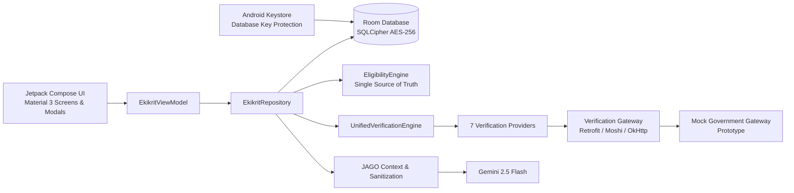

# Ekikrit

**One app for every scholarship a Scheduled Tribe student is entitled to.**

Ekikrit is a native Android prototype built for **Smart India Hackathon 2026, Problem Statement SIH26238**. It provides a unified scholarship experience for Scheduled Tribe (ST) students, including PVTG communities, by bringing scholarship discovery, eligibility, reusable digital documents, multi-source verification, application tracking, reviewer exception handling, DBT visibility and multilingual assistance into one mobile application.

> **Prototype status:** Government registry integrations are simulated for this prototype. UIDAI, DigiLocker, APAAR, AISHE, UDISE+, UGC/NTA and e-District responses are provided through an in-process mock gateway so the complete workflow can be demonstrated without depending on live government APIs.

---

## Why Ekikrit?

A student may be eligible for multiple scholarship pathways but still face fragmented portals, repeated document uploads, unclear application status and delays when information from different records does not match.

Ekikrit is designed around a single beneficiary journey:

* **Discover once:** evaluate the student's profile against five scholarship pathways.
* **Upload once:** reuse verified digital credentials across applications.
* **Verify together:** run seven verification sources through one unified workflow.
* **Handle exceptions intelligently:** route reviewable discrepancies to an officer instead of automatically rejecting the student.
* **Track everything:** follow application stages, review status and payment history from one place.
* **Make it accessible:** provide English, Hindi, Odia and Gondi interfaces with voice assistance.

---

## Core Features

| Area                            | What it does                                                                                                                   |
| ------------------------------- | ------------------------------------------------------------------------------------------------------------------------------ |
| **Unified dashboard**           | Shows active applications, pending actions, notifications and the student's current scholarship opportunities.                 |
| **Five scholarship pathways**   | Pre-Matric, Post-Matric, Top Class Education, National Fellowship for ST students, and National Overseas Scholarship.          |
| **Eligibility engine**          | Evaluates category, education level, institution, income and application state, and explains eligibility results.              |
| **One-active-scholarship rule** | Prevents conflicting active scholarship applications where the prototype's eligibility rules require mutual exclusion.         |
| **DigiLocker wallet**           | Provides a reusable digital document wallet for caste, income, academic and identity-related credentials.                      |
| **Seven-source verification**   | Demonstrates verification through UIDAI, DigiLocker, APAAR, AISHE, UDISE+, UGC/NTA and e-District.                             |
| **Exception routing**           | A reviewable income variance becomes a non-blocking Reviewer Desk item instead of an automatic rejection.                      |
| **Reviewer Desk**               | Provides an officer-facing queue for resolving verification exceptions.                                                        |
| **Application tracking**        | Displays progress from application submission through institute, state and ministry verification to sanction and disbursement. |
| **DBT payments**                | Consolidates scholarship disbursement information for the beneficiary.                                                         |
| **Unclaimed-beneficiary nudge** | Identifies scholarship pathways for which a student may be eligible but has not yet applied.                                   |
| **Audit trail**                 | Records application and reviewer actions with actor and timestamp information.                                                 |
| **DPDP consent**                | Provides an explicit consent flow and consent revocation control for AI-related processing.                                    |
| **Offline-first workflow**      | Allows applications to be stored locally as drafts and synchronized when connectivity returns.                                 |
| **Multilingual UI**             | English, Hindi, Odia and Gondi.                                                                                                |
| **JAGO assistant**              | A context-aware scholarship assistant for eligibility, application status, documents, discrepancies and payment questions.     |

---

## JAGO: Unified Tribal Scholarship Assistant

**JAGO** is the in-app assistant designed to make the scholarship system easier to understand.

It can answer questions about:

* scholarship eligibility
* application status
* pending actions
* DigiLocker documents
* income discrepancies
* DBT payment information
* how to apply

### AI mode

When a valid Gemini API key is configured and the device has connectivity, JAGO sends the student's sanitized application context to **Gemini 2.5 Flash** through Google's Generative Language REST API.

The response is grounded in the current application state rather than being treated as an independent source of truth.

### Built-in fallback mode

When Gemini is unavailable, disabled or times out, JAGO falls back to a local multilingual intent engine.

This allows the core assistant experience to continue without a network connection.

### Data minimisation

The AI layer receives an allow-listed, de-identified summary rather than the student's full record.

The application is designed to avoid sending:

* Aadhaar numbers
* full bank account numbers
* IFSC codes
* mobile numbers
* date of birth
* APAAR identifiers
* institution identifiers
* exact income values
* raw values from verification mismatches

Free-text input is additionally sanitized before being included in AI context.

The system prompt instructs JAGO to use only supplied application facts, treat application stage and eligibility state as authoritative, avoid requesting sensitive identity credentials and ignore instructions embedded inside user messages.

> **Gondi note:** Gondi support is best-effort and should be reviewed with native speakers before production deployment.

---

## Architecture



### Application layers

**`ui/`**

Jetpack Compose screens, reusable UI components, localization and `EkikritViewModel`.

**`data/repository/`**

Central repository for students, applications, documents, payments, notifications, reviewer queue data and JAGO context.

**`data/local/`**

Room database, DAOs, seed data and database key management.

**`data/remote/`**

Verification API contracts, gateway handling, Retrofit/Moshi/OkHttp networking and the mock government gateway used by the prototype.

**`data/ai/`**

JAGO AI service, Gemini integration, language detection, intent classification and multilingual fallback responses.

**`domain/`**

Pure Kotlin business logic including:

* `EligibilityEngine`
* `UnifiedVerificationEngine`
* JAGO grounding and sanitization rules

---

## What is real and what is simulated?

| Component                                      | Status                                      |
| ---------------------------------------------- | ------------------------------------------- |
| Room database                                  | **Real**                                    |
| SQLCipher database encryption                  | **Real**                                    |
| Android Keystore-based database key protection | **Real**                                    |
| Aadhaar and bank identifier masking            | **Real**                                    |
| Verification client architecture               | **Real**                                    |
| Retrofit / Moshi / OkHttp networking stack     | **Real**                                    |
| TLS-restricted gateway configuration           | **Real**                                    |
| Eligibility engine                             | **Real application logic**                  |
| Unified verification engine                    | **Real application logic**                  |
| Government registry responses                  | **Simulated**                               |
| DigiLocker document retrieval                  | **Simulated**                               |
| Government login / OTP authentication          | **Local prototype only**                    |
| Demo student identities                        | **Fictional seed data**                     |
| Gemini integration                             | **Real when a valid API key is configured** |
| Local JAGO fallback                            | **Real application logic**                  |

### Prototype verification scenario

For the demonstration workflow:

* six verification sources return a verified response
* e-District produces a deterministic income variance
* the variance is routed as a non-blocking reviewer exception
* the officer can review and resolve the exception
* the application then progresses to the next verification stage

This allows the complete student-to-officer workflow to be demonstrated consistently without requiring external government systems.

---

## Security and Privacy

Ekikrit is designed with privacy and least-privilege principles in mind.

### Data at rest

The Room database uses SQLCipher encryption.

The database passphrase is protected through the Android Keystore using a non-exportable key.

### Backups

Android application backup is disabled, with explicit backup and device-transfer exclusions.

### Network security

The application blocks cleartext traffic and uses restricted TLS configuration for remote communication.

### Data minimisation

Only the data required for the relevant verification or AI workflow should be passed to those services.

### AI consent

AI processing is subject to the application's consent flow. When consent has been revoked, third-party AI processing is skipped.

### Least privilege

The application requests only:

* `INTERNET`
* `ACCESS_NETWORK_STATE`

No storage, camera, microphone or location permission is required by the core application workflow.

### Reviewer privacy

The Reviewer Desk is designed to expose the disputed field and relevant case information without unnecessarily exposing the student's complete identity profile.

---

## Getting Started

### Requirements

* Android Studio, recent stable release
* JDK 21
* Android SDK 36
* Minimum Android API: 24

### Clone the repository

```bash
git clone https://github.com/theanshdhyani/Ekikrit.git
cd Ekikrit
```

### Build the debug APK

```bash
./gradlew assembleDebug
```

### Install on a connected device

```bash
./gradlew installDebug
```

The application can run without cloud configuration. JAGO will use its built-in fallback mode when Gemini is not configured.

---

## Gemini Configuration

The current JAGO implementation uses Gemini 2.5 Flash through Google's Generative Language REST API.

To enable Gemini mode:

1. Configure a valid `GEMINI_API_KEY` through the project's supported secrets configuration.
2. Rebuild the application.
3. Ensure the device has network connectivity.
4. Ensure the student has granted the required AI-processing consent.

Without a valid key, JAGO automatically uses its local multilingual fallback.

> Do not commit a real API key to the repository.

---

## Demo Personas

The repository contains fictional seed data for deterministic demonstrations.

### Birsa Munda Tirkey

`STU_2026_01`

* PVTG: Birhor
* Institution: NIT Rourkela
* Course: B.Tech CSE
* Annual income: ₹2,10,000
* Active Post-Matric application
* Demonstration income variance routed to Reviewer Desk
* Historical Pre-Matric award
* Top Class evaluation

### Sunita Soren

`STU_2026_02`

* ST: Santhal
* Institution: IIT Kharagpur
* Course: B.Tech Metallurgical Engineering
* Annual income: ₹3,20,000
* Top Class application shown as sanctioned and disbursed

### Jaipal Singh Munda

`STU_2026_03`

* ST: Ho
* Institution: Utkal University
* Programme: M.Phil/Ph.D Tribal Studies
* Annual income: ₹1,80,000
* High-eligibility candidate for NFST and NOS

### Reviewing Officer

`REV_OFFICER_01`

* District Tribal Welfare Officer
* Demo Reviewer Desk identity
* Used to review and resolve verification exceptions

The application contains a single role switch control for the student and officer demo workflow.

---

## Demo Flow

The recommended demonstration sequence is:

```text
Dashboard
   ↓
5 Scholarship Pathways
   ↓
Eligibility Result
   ↓
DigiLocker Wallet
   ↓
Application
   ↓
Seven-Source Verification
   ↓
Income Variance
   ↓
Reviewer Desk
   ↓
Officer Resolution
   ↓
Application Progress
   ↓
DBT Payments
   ↓
JAGO Assistant
   ↓
Language / Accessibility
   ↓
Security & Privacy
```

This sequence demonstrates the central Ekikrit concept:

> **Discover → Verify → Apply → Review → Track → Receive**

---

## Testing

### Run the JVM test suite

```bash
./gradlew testDebugUnitTest
```

The current repository contains **39 test methods** covering eligibility, verification, database integrity, identity isolation, reviewer workflows, JAGO grounding and multilingual behaviour.

### Build the APK

```bash
./gradlew assembleDebug
```

### Continuous Integration

The repository uses GitHub Actions to:

1. run the unit test suite
2. build the debug APK
3. build the release APK
4. upload APK artifacts

Workflow:

```text
.github/workflows/android.yml
```

---

## Test Coverage

| Test Suite                           | Coverage                                                                                                |
| ------------------------------------ | ------------------------------------------------------------------------------------------------------- |
| `EkikritFinalValidationTest`         | Database seeding, unique constraints, identity isolation, reviewer resolution and end-to-end validation |
| `EkikritVerificationAndReviewerTest` | Production repository, seven-source verification, exception creation and reviewer resolution            |
| `EkikritEligibilityAndOwnershipTest` | Eligibility rules, income limits, PVTG entitlement and student isolation                                |
| `EligibilityEngineTest`              | Eligibility scoring, missing-document handling and scholarship conflicts                                |
| `JagoAiServiceTest`                  | JAGO response generation and AI fallback behaviour                                                      |
| `JagoMultilingualIntentTest`         | Multilingual intent detection                                                                           |
| `UnifiedVerificationTest`            | Seven-source verification execution and exception handling                                              |
| `ExampleRobolectricTest`             | Android/Robolectric test environment                                                                    |
| `ExampleUnitTest`                    | Basic JVM unit-test environment                                                                         |

---

## Known Limitations

This project is a working prototype, not a production deployment.

### Government integrations

Government registries and DigiLocker are simulated.

Production deployment would require:

* approved government APIs or gateways
* authentication and authorisation mechanisms
* official integration contracts
* production monitoring and operational controls

### Authentication

The current login flow is local and does not implement production OTP-based identity verification.

### Release signing

CI release builds use a generated debug keystore unless a production signing key is configured.

Therefore, CI release APKs are **not Play Store production artifacts**.

### Database migrations

The current prototype still allows destructive migration fallback. Production deployment should use explicit Room migrations.

### Eligibility hardening

Some eligibility checks use string-based matching and should be tightened against authoritative master-data identifiers before production use.

### AI behaviour

Gemini responses are probabilistic and should remain bounded by the application's grounded context and business rules.

### Language review

Odia and especially Gondi output should undergo native-speaker validation before production deployment.

---

## Roadmap

### Government integration

Replace the mock government gateway with authorised production integrations while retaining the existing verification contracts.

### Authentication

Introduce real identity verification and role-based authentication for beneficiaries and officers.

### Database evolution

Add production-grade Room migrations and a tamper-evident audit architecture.

### Notifications

Introduce deadline reminders and event-driven application notifications.

### AI safety

Expand JAGO evaluation, multilingual review, prompt-injection testing and production monitoring.

### Accessibility

Continue improving voice navigation, screen narration and low-connectivity workflows.

---

## Technology Stack

* **Kotlin**
* **Jetpack Compose**
* **Material 3**
* **Android SDK 36**
* **Room**
* **SQLCipher**
* **Android Keystore**
* **Kotlin Coroutines / Flow**
* **Retrofit**
* **Moshi**
* **OkHttp**
* **Gemini 2.5 Flash**
* **JUnit**
* **Robolectric**
* **Roborazzi**
* **GitHub Actions**

---

## Repository

**GitHub:**
https://github.com/theanshdhyani/Ekikrit

**Problem Statement:**
**SIH26238**

---

## Licence

No licence file is currently included in the repository. Add an appropriate licence before accepting external contributions.
